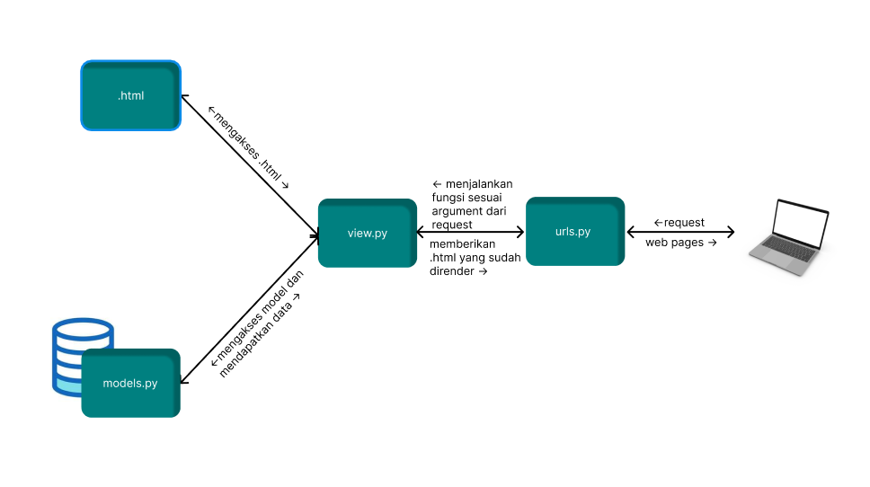
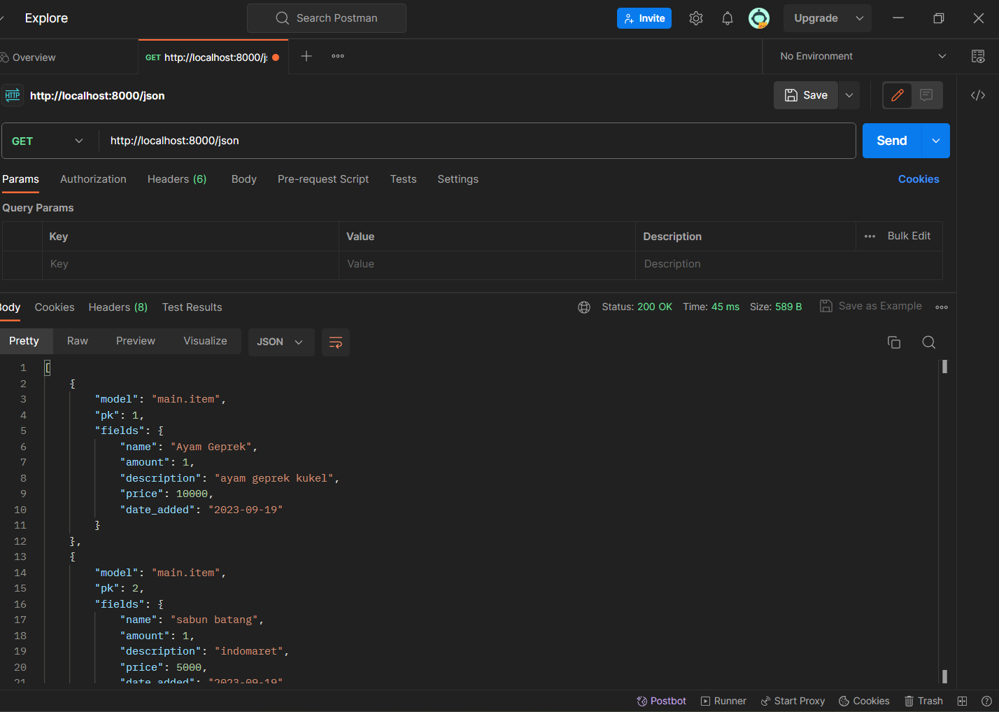
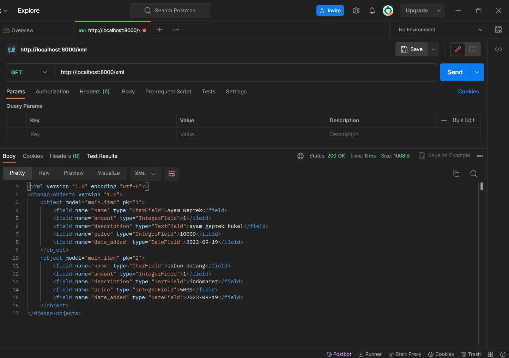
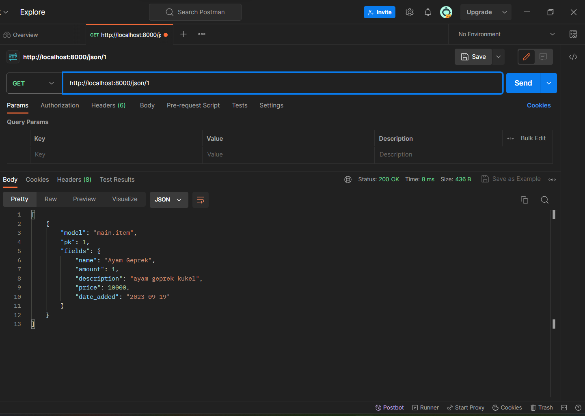
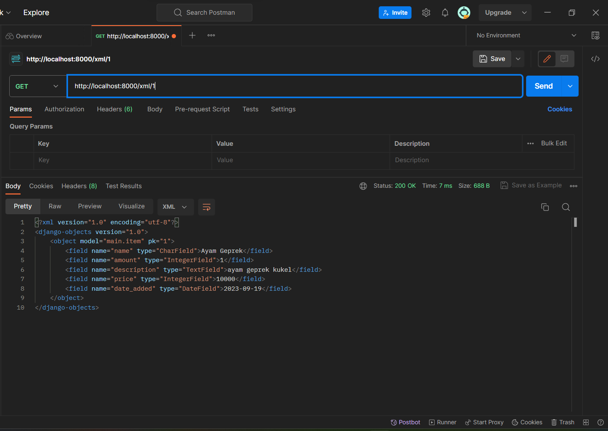
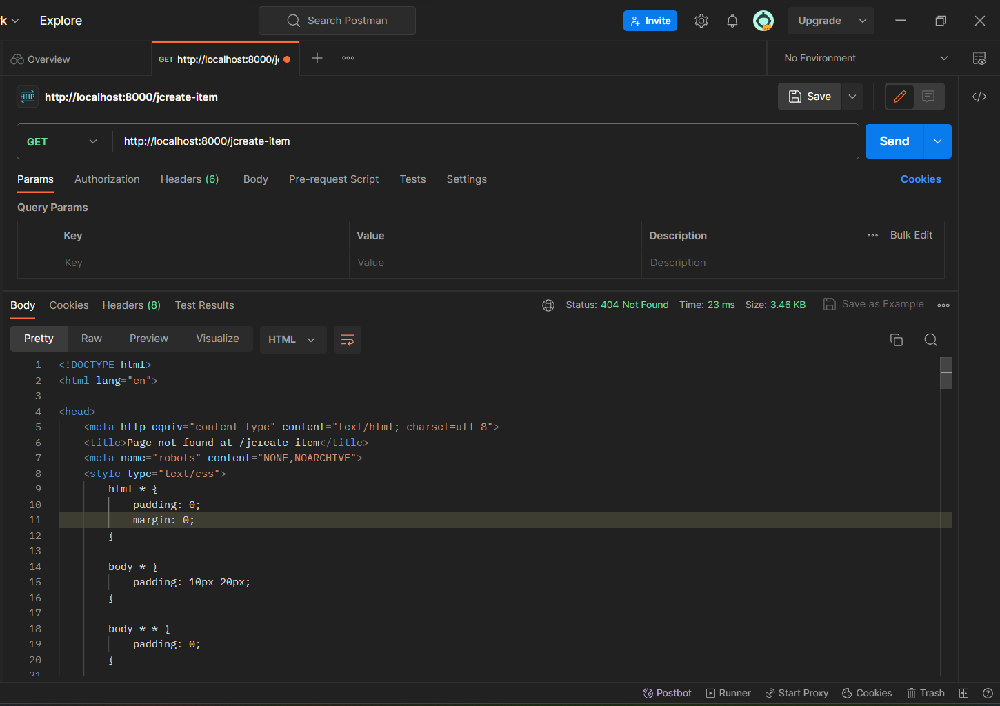

Link Adaptable [Adaptable](https://xpnse.adaptable.app/ "Tugas 2 PBP"). 

# TUGAS 2
pertanyaan:

A. Jelaskan bagaimana cara kamu mengimplementasikan checklist di atas secara step-by-step (bukan hanya sekadar mengikuti tutorial).

B. Buatlah bagan yang berisi request client ke web aplikasi berbasis Django beserta responnya dan jelaskan pada bagan tersebut kaitan antara urls.py, views.py, models.py, dan berkas html.

C. Jelaskan mengapa kita menggunakan virtual environment? Apakah kita tetap dapat membuat aplikasi web berbasis Django tanpa menggunakan virtual environment?

D. Jelaskan apakah itu MVC, MVT, MVVM dan perbedaan dari ketiganya.

Jawab:

<h3>A.</h3> 

1. **Membuat sebuah proyek Django baru.**

Sebelumnya saya buat terlebih dahulu direktori untuk proyek baru Bernama Tugas2PBP. Kemudian saya inisiasi git dan menghubungkannya ke github dengan add, commit, dan push. lalu membuat file .gitignore. kemudian membuat dan mengkatifkan virtual environment menggunakan command:

`python -m venv env`

`env\Scripts\activate.bat`

virtual environment memungkinkan suatu mesin untuk memiliki versi python yang berbeda untuk tiap proyek tanpa menimbulkan error. Dengan virtual environment tiap proyek dapat menginstall dependensi dengan versi yang berbeda-beda.  
selanjutnya saya menginstall dependencies yang dibutuhkan untuk proyek ini menggunakan command:

`pip install -r requirements.txt`

pip merupakan sistem manajemen paket yang berfungsi untuk meng-install dan mengelola paket dalam proyek python. Disini saya menginstall dependencies yang tertera pada file requirements.txt
Kemudian saya membuat project Django baru menggunakan command:

`django-admin startproject Inventory .`


2. **Membuat aplikasi dengan nama main pada proyek tersebut.**

Aplikasi dengan nama main saya buat dengan menjalankan command berikut:
python manage.py startapp main
aplikasi main kemudian saya daftarkan ke list INSTALLED_APPS di file settings.py. ini dilakukan agar proyek Django dapat mengenali app main.

3. **Melakukan routing pada proyek agar dapat menjalankan aplikasi main.**

file urls.py yang berada di direktori Inventory (proyek) saya ubah isinya menjadi sebagai berikut:

```
urlpatterns = [
    path('', include('main.urls')),
]
```

Disini rute fungsi path adalah  ‘ ’ yang berarti direktori saat ini. Sehingga direktori root akan menampilkan app main.

4. **Membuat model pada aplikasi main dengan nama Item dan memiliki atribut wajib sebagai berikut.**
•	name sebagai nama item dengan tipe CharField.
•	amount sebagai jumlah item dengan tipe IntegerField.
•	description sebagai deskripsi item dengan tipe TextField.
Model dibuat dengan mengakses ke file models.py di direktori main, di file models.py saya buat Model dengan nama Item dan memberikan atribut sebagai berikut:
```
class Item(models.Model):
    name = models.CharField(max_length=255)
    amount = models.IntegerField()
    description = models.TextField()
    price = models.IntegerField()
```
Terdapat atribut baru yang saya tambahkan yaitu price. Atribut ini akan digunakan nanti untuk tema kecil saya.

5. **Membuat sebuah fungsi pada views.py untuk dikembalikan ke dalam sebuah template HTML yang menampilkan nama aplikasi serta nama dan kelas kamu.**

Pada file views.py saya membuat fungsi show_main dengan paramenter request. Lalu saya  menambahkan context yaitu name dan class dengan value nama saya (Muhammad Iqbal) dan kelas saya (PBP A). kemudian saya return render(request, "main.html", context). 
Fungsi render disini adalah fungsi yang digunakan untuk merender sebuah halaman HTML yang akan dikirmkan ke website pengguna. Argumen request adalah permintaan yang diterima oleh server. “main.html” adalah nama template yang digunakan untuk menghasilkan halaman HTML. Dictionary context adlaah data yang akan dikirimkan ke tampilan.
Setelah itu , di files main.html pada subdirektori templates saya menuliskan kode HTML sebagai berikut:
```
<h1>Pengelolaan Pengeluaran Keuangan</h1>
<h5>Name: </h5>
<p>{{ name }}<p>
<h5>Class: </h5>
<p>{{ class }}<p>
```
“ {{ }} “ merupakan syntax HTML untuk variabel. Variabel ini didapatkan dari context yang berada di file views.py.

6. **Membuat sebuah routing pada urls.py aplikasi main untuk memetakan fungsi yang telah dibuat pada views.py.**
```
urlpatterns = [
    path('', show_main, name='show_main'),
]
```

7. **Melakukan deployment ke Adaptable terhadap aplikasi yang sudah dibuat sehingga nantinya dapat diakses oleh teman-temanmu melalui Internet.**

Deployment ke adaptable dilakukan sama seperti pada tutorial 0. 

8. **Membuat sebuah README.md yang berisi tautan menuju aplikasi Adaptable yang sudah di-deploy, serta jawaban dari beberapa pertanyaan berikut.**

Referensi:
https://stackoverflow.com/questions/39055728/importance-of-virtual-environment-setup-for-django-with-python


<h3>B.</h3> 



<h3>C.</h3> 

Virtual environment digunakan untuk mengisolasi lingkungan proyek agar tidak bertabrakan dengan proyek lain yang berbeda versi. Jika kita tidak menggunakan virtual environment kita masih tetap dapat membuat aplikasi web berbasis Django. Namun, kemungkinan error akan besar karena versi paket atau dependensi antar proyek belum tentu sama meskipun modulnya sama. 

sumber: https://stackoverflow.com/a/44392668

<h3>D.</h3> 

MVT, MVC, dan MVVM ketiganya merupakan pola desain arsitektur untuk pengembangan aplikasi. MVC atau model view controller merupakan pola desain. MVC terbagi menjadi tiga yaitu Model untuk mengatur logika bisnis, View untuk menampilkan data, dan Controller untuk menghubungkan model dan view. MVT atau model view template merupakan variasi dari pola desain MVC yang digunakan dalam framework Django. Perlu diketahui bahwa view di MVT dan di MVC berbeda. View pada MVT ekuivalen dengan controller pada MVC. MVVM atau Model View View Model adalah pengembangan dari MVC. Model MVC ini menyelesaikan kekurangan pada model MVC yaitu dengan membuat separasi jelas antara business logic dan data presentation logic. 

Sumber:
https://www.geeksforgeeks.org/difference-between-mvc-mvp-and-mvvm-architecture-pattern-in-android/


# TUGAS 3
###	 Apa perbedaan antara form POST dan form GET dalam Django?
Form post lebih secure daripada form get. Ketika menggunakan method get, request parameter di append ke URL. Hal ini membuat data sensitive terekspos, dan penyerang dapat dengan mudah mendapatkan data sensitif tersebut. Sedangkan ketika kita menggunakan method POST, request parameter tidak di append ke URL melainkan disimpan pada body HTTP request. Selain itu, parameter yang dapat dikirm method GET terbatas karena request parameter di append ke URL. Namun, method GET masih sering digunakan karena lebih cepat dan lebih simple daripada POST. Secara konvensi, method GET digunakan ketika meminta request sedangkan POST digunakan ketika mengirim request.
Sumber: https://www.geeksforgeeks.org/difference-between-http-get-and-post-methods/

###	 Apa perbedaan utama antara XML, JSON, dan HTML dalam konteks pengiriman data?
XML dan HTML keduanya merupakan markup language, perbedaannya XML didesain untuk pegiriman data sedangkan HTML digunakan untuk memformat dan menampilkan data. JSON dan XML keduanya digunakan untuk pengiriman data, perbedaannya XML menggunakan struktur tag untuk merepresentasikan data, sedangkan JSON menggunakan key value pair.

###	Mengapa JSON sering digunakan dalam pertukaran data antara aplikasi web modern?
JSON sering digunakan karena human dan machine readable. untuk informasi yang sama JSON mengirimkan data yang lebih sedikit dibandingkan dengan XML, karena JSON tidak menggunakan struktur tag. selain itu mayoritas bahasa pemrograman saat ini sudah menyediakan dukungan bawaan untuk mengurai dan menghasilkan data dalam format JSON. JavaScript, yang digunakan dalam sebagian besar aplikasi web, memiliki kemampuan yang mudah untuk mengurai data JSON serta menghasilkannya kembali.
###	 Jelaskan bagaimana cara kamu mengimplementasikan checklist di atas secara step-by-step (bukan hanya sekadar mengikuti tutorial).
1.	 **Membuat input form untuk menambahkan objek model pada app sebelumnya**.
-	Sebelum membuat file form.py saya menambahkan item baru yaitu item date_added. Kemudian Saya melakukan migrasi model.
-	Pertama saya membuat file form.py, fields pada form.py diisi dengan item yang dideklarasikan pada class product model.
-	Kemudian saya membuat fungsi create_item pada file views.py di main. Fungsi ini digunakan untuk menangani permintaan pembuatan item baru dan memvalidasi form.
-	Buat file create_item.html untuk dirender oleh fungsi create_item
-	Setelah itu, tambahkan button create_item pada file main.html untuk menampilkan file create_item.html dengan cara melakukan routing URL
2.	 **Tambahkan 5 fungsi views untuk melihat objek yang sudah ditambahkan dalam format HTML, XML, JSON, XML by ID, dan JSON by ID.**
-	Untuk HTML disini saya membuat halaman page baru yaitu show-detail. Pertama saya membuat file HTML, data yang disimpan diperlihatkan dalam bentuk table pada kolom yang sesuai yaitu name, amount, price, description, dan date added.
-	Setelah membuat HTML show-detail saya membuat fungsi show detail di views.py dengan menambahkan context item yang didapatkan dari Item.objects.all()
-	Setelah itu saya menambahkan button detail pada file main.html dan melakukan routing URL untuk show-detail.
-	kemudian, saya membuat Fungsi XML, JSON, XML by ID, dan JSON by ID. Untuk membuat fungsi-fungsi ini saya menggunakan serializer untuk menerjemahkan data pada database ke format XML dan JSON, untuk XML by ID dan JSON by ID kita perlu menerapkan filter mengambil data yang memiliki nilai id yang sama dengan primary key.
3.	 **Membuat routing URL untuk masing-masing views yang telah ditambahkan pada poin 2.**
-	Routing dilakukan dengan menambahkan path pada file url.py, path tersebut adalah sebagai berikut:
```
    path('xml/', show_xml, name='show_xml'), 
    path('json/', show_json, name='show_json'),
    path('xml/<int:id>/', show_xml_by_id, name='show_xml_by_id'),
    path('json/<int:id>/', show_json_by_id, name='show_json_by_id'),

```
ketika URL cocok dengan pola maka akan memanggil fungsi yang sesuai.

### Mengakses kelima URL di poin 2 menggunakan Postman
* **JSON**


* **XML**


* **JSON by ID**


* **XML by ID**


* **HTML**



# Tugas 4

## Apa itu Django UserCreationForm, dan jelaskan apa kelebihan dan kekurangannya?
Usercreationform merupakan kelas yang disediakan Django untuk membuat user baru. form ini meminta informasi yang diperlukan untuk membuat user baru seperti Username, Password1 dan Pasword2. Password2 digunaka untuk komformasi password.
Kelebihan dari kelas ini adalah mudah digunakan. Kita tidak perlu lagi melakukan implmentasi manual dari awal untuk pembuatan user baru. kita hanya perlu membuat kelas UserCreationForm dan menggunakan method yang telah disediakan oleh kelas UserCreationForm. 
Kekurangannya, UserCreationForm menyediakan field yang terbatas yaitu Username dan Password. jika kita mau menambahkan field lain misalnya field email kita harus memodifikasi kelas UserCreationForm atau membuat form registrasi user dari awal. Selain itu, kelas UserCreationForm tidak mempunyai fitur validasi apakah Username sudah ada, sehingga kita perlu menambahkannya secara manual.
[Sumber](https://www.javatpoint.com/django-usercreationform)

## Apa perbedaan antara autentikasi dan otorisasi dalam konteks Django, dan mengapa keduanya penting?
Authentication adalah mekanisme memverifikasi apakah pengguna merupakan orang yang mereka klaim. Biasanya melibatkan pencocokan username dan password yang diberi pengguna dengan data yang ada di database. Sedangkan Authorization menentukan hal apa yang dizinkan untuk dilakukan oleh pengguna yang sudah di otentikasi. Contohnya seperti mengedit profil akun sendiri.
Kedua konsep ini penting. Autentikasi dan otorisasi mencegah akses yang tidak sah ke aplikasi. Autentikasi memastikan hanya pengguna yang sah yang dapat mengakses aplikasi, sedangkan otorisasi memastikan bahwa pengguna hanya dapat melakukan Tindakan yang sesuai dengan izin mereka. 
[Sumber](https://docs.djangoproject.com/en/4.1/topics/auth/)

## Apa itu cookies dalam konteks aplikasi web, dan bagaimana Django menggunakan cookies untuk mengelola data sesi pengguna?
Cookies adalah data kecil yang disimpan di browser pengguna. Cookies digunakan untuk menyimpan informasi tentang pengguna dan preferensinya untuk meningkatkan pengalaman pengguna. Ketika pengguna mengunjungi situs web, situs web akan membaca cookie untuk mengingat pengguna dan preferensinya. Cookies pada Django disimpan dalam bentuk key value pair, contoh Username=liqba. Cookie bisa berisi berbagai jenis informasi tidak terbatas pada username dan bahasa preferensi. 
Cara Django menggunakan cookies adalah sebagai berikut:
1.	Ketika pengguna mengunjungi situs, Django membuat sesi baru dan menghasilkan ID sesi unik.
2.	Django kemudian mengirim cookie ke browser pengguna dengan ID sesi ini.
3.	Pada kunjungan berikutnya, browser mengirimkan cookie ini kembali ke server. Django kemudian mencocokkan ID sesi dalam cookie dengan data sesi yang disimpan di server.
4.	Jika ID sesi cocok, Django tahu bahwa request ini berasal dari pengguna yang sama dan dapat mengambil data sesi yang sesuai.

Sumber: https://www.askpython.com/django/django-cookies

## Apakah penggunaan cookies aman secara default dalam pengembangan web, atau apakah ada risiko potensial yang harus diwaspadai?
Baik atau buruknya cookie tergantung pada pengembang situs web yang dikunjungi. Secera default cookie aman untuk digunakan sebab data tidak disimpan di server meliankan di web browser klien.  sebuah website tidak bisa membaca cookie dari website lain. namun sebuah website dapat memiliki potongan dari website lain, dan website lain dapat mengakses sekaligus menyimpan cookie pengguna. Dengan ini, potongan web tersebut dapat menampilkan iklan yang disesuaikan dengan prefrensi pengguna juga sekaligus menyimpan aktivitas pengguna, meskipun website utama tidak menyimpan cookie. sehingga pengguna perlu mewaspadai sebelum menerima cookie dari website, data apa saja yang disimpan didalam cookie.  
Sumber: https://www.youtube.com/watch?v=I01XMRo2ESg

## Jelaskan bagaimana cara kamu mengimplementasikan checklist di atas secara step-by-step (bukan hanya sekadar mengikuti tutorial).
**1 . membuat fungsi dan form registrasi**

import redirect, UserCreationForm, dan messages di file views.py
* UserCreationForm merupakan kelas yang disediakan DJango untuk membuat form registrasi.
kemudian buat fungsi register, sebagai berikut:
```
def register(request):
    form = UserCreationForm()

    if request.method == "POST":
        form = UserCreationForm(request.POST)
        if form.is_valid():
            form.save()
            messages.success(request, 'Your account has been successfully created!')
            return redirect('main:login')
    context = {'form':form}
    return render(request, 'register.html', context)
```
* if request.method == "POST": mengecek apakah metode request adalah POST, jika ya berarti form telah disubmit oleh pengguna
* redirect berfungsi untuk mengarahkan pengguna ke halaman lain, disini main.
* UserCreationForm(request.POST) untuk membuat instance UserCreationForm dengan data dari request.POST, request.POST berisi data yang disubmit oleh pengguna. 

**2 . buat berkas HTML register.html**

berkas register.html berfungsi untuk menampilkan halaman register, konten filenya mirip seperti file create_item.html dimana html menampilkan form.as_table 

3 . routing path register
```
from main.views import register
...
...
...
path('register/', register, name='register'), 
```

**4 . buat fungsi login dan implementasikan cookie**

di file views.py import terlebih dahulu authenticate dan login dari django.contrib.auth 
```
def login_user(request):
    if request.method == 'POST':
        username = request.POST.get('username')
        password = request.POST.get('password')
        user = authenticate(request, username=username, password=password)
        if user is not None:
            login(request, user)
            response = HttpResponseRedirect(reverse("main:show_main")) 
            response.set_cookie('last_login', str(datetime.datetime.now()))
            return response
        else:
            messages.info(request, 'Sorry, incorrect username or password. Please try again.')
    context = {}
    return render(request, 'login.html', context)
```
* user = authenticate(request, username=username, password=password) ; menggunakan fungsi authenticate untuk memverifikasi username dan password pengguna. jika cocok dengan yang ada di database fungsi authenticate mengembalikan objek user
* if user is not None: ; mengecek apakah objek user ada jika iya maka user telah berhasil di autentikasi
* response.set_cookie('last_login', str(datetime.datetime.now())) menyimpan cookie dengan key 'last_login' dan value str(datetime.datetime.now())

**5 . buat berkas login.html dan routing path login** 

di main/templates, berkas login.html berisi field Username dan Password

di views.py:
```
from main.views import login_user
...
...
...
path('login/', login_user, name='login'),
```

**6 . tambahkan context last_login ke dalam variabel context di fungsi show_main**
```
    context = {
        'name': 'Muhammad Iqbal',
        'class': 'PBP A',
        'last_login': request.COOKIES['last_login'],
    }
```

**7 . buat fungsi logout dan hapus cookie**

di views.py buat fungsi logut_user

```
def logout_user(request):
    logout(request)
    response = HttpResponseRedirect(reverse('main:login'))
    response.delete_cookie('last_login')
    return response
```
* logout(request) ; menghapus sesi pengguna saat ini
* response.delete_cookie('last_login') menghapus cookie dengan key last_login 

**8 . tambahkan button logout di main.html dan lakukan routing**
```
<a href="">
    <button>
        Logout
    </button>
</a>
```
```
from main.views import logout_user
...
...
...
path('logout/', logout_user, name='logout'),
```
**9 . merestriksi halaman main**

menambahkan kode
```
@login_required(login_url='/login')
```
diatas fungsi show_main

**10 . menghubungkan model item dengan user**

di models.py import User dari django.contrib.auth.models

kemudian, tambahkan model user ke kelas Item
```
class Item(models.Model):
    user = models.ForeignKey(User, on_delete=models.CASCADE)
    ...
```
* on_delete=models.CASCADE ; ketika objek user dihapus maka semua data yang berkaitan dengan objek user juga ikut kehapus

**11 . melakukan migrasi dan add commit push**

jalankan command berikut di terminal

`python manage.py makemigrations`

`python manage.py migrate`

`git add .`

`git commit -m "menyelesaikan Tugas 4"`

`git push origin -u main`

# Tugas 5

## No 1
1. Universal Selector (*):

digunakan untuk memilih dan memberikan gaya ke semua elemen yang ada dalam halaman. Penggunaannya cocok ketika ingin memberikan pengaturan umum seperti box-sizing atau mereset margin dan padding.

2. Type Selector / Element Selector:

Selector ini bertujuan untuk memberikan gaya khusus pada setiap elemen berdasarkan jenisnya. Misalnya, untuk memberikan ukuran font tertentu pada semua elemen h1.

3. Class Selector:
Class Selector sangat berguna ketika sekelompok elemen memerlukan gaya khusus, namun tidak semua elemen tersebut memiliki jenis yang sama. Dengan class, kita dapat memberikan gaya pada berbagai elemen dan mengulangnya sepanjang halaman.

4. ID Selector:

Digunakan untuk memberikan gaya pada elemen tunggal dengan atribut id tertentu. Sangat cocok untuk pemberian gaya khusus pada elemen yang unik dalam satu halaman. Perlu diingat, sebuah ID harus unik dan hanya boleh digunakan sekali dalam satu halaman.

5. Grouping Selector:
Memungkinkan pengelompokan beberapa selector sekaligus.
Dengan selector ini, kita dapat mengurangi pengulangan kode dengan mengelompokkan beberapa selector yang memerlukan gaya yang sama. Ini membantu meningkatkan efisiensi dalam penulisan kode CSS.


## No 2
Header : Merupakan bagian atas atau pembuka dari suatu konten area di halaman web. Umumnya, bagian ini berisi judul atau logo dari situs.

Div : Adalah kontainer blok yang digunakan untuk mengelompokkan elemen-elemen bersama.

Navigasi (nav): Elemen ini umumnya berisi menu navigasi yang membantu pengguna berpindah antar halaman atau konten di dalam sebuah situs web.

Main Content (main): bagian utama dari halaman web, di mana konten utama disajikan kepada pengguna.

Article: Mewakili konten yang mandiri dan bisa dipahami secara independen dari konten lain di halaman, seperti blog post atau berita.

Section: Membagi dokumen menjadi bagian atau seksi yang berbeda. Biasanya berisi konten yang terkait dengan judul khusus.

Footer: Merupakan bagian penutup dari area konten. Biasanya berisi informasi tambahan seperti hak cipta atau link ke halaman lain.

Figure & Figcaption: Elemen ini digunakan untuk menyajikan konten media, seperti gambar, dengan caption yang opsional.

Time: Memberikan informasi tentang waktu atau tanggal dalam konten.

Video & Audio: Digunakan untuk menampilkan konten media, baik itu video atau audio, dalam halaman web.

referensi: https://www.w3schools.com/html/html5_semantic_elements.asp#:~:text=,element%20can%20be%20used


## No 3
- **Margin**: Jarak antara elemen dengan elemen lainnya di luar border.
- **Padding**: Jarak antara konten elemen dan border elemen tersebut.

## No 4

Komponen dan Kelas Utilitas: Bootstrap dibangun dengan dua fitur utama yaitu komponen  yang sudah dibuat sebelumnya dan kelas utilitas. Sedangkan Tailwind lebih fokus pada kelas utilitas dan tidak menyediakan komponen yang sudah jadi seperti Bootstrap.

Customisasi dan Fleksibilitas: Tailwind dikenal lebih customizable dan fleksibel dibandingkan dengan Bootstrap.

Kurva Belajar: Kurva belajar untuk Tailwind dianggap tinggi rendah dibandingkan dengan Bootstrap.

Pendekatan Desain: Tailwind bukan kit UI yang sudah jadi dan siap pakai seperti Bootstrap. sehingga dengan Tailwind, pengembang memiliki kebebasan lebih dalam mendesain tampilan sesuai keinginan, sedangkan Bootstrap menyediakan komponen yang sudah jadi dan siap digunakan.

### Kapan sebaiknya menggunakan Bootstrap daripada Tailwind?

1. Ketika kita membutuhkan solusi cepat dengan komponen yang sudah siap pakai.
2. Jika kita kurang familiar dengan desain dan ingin mengkitalkan komponen yang sudah ada.
3. Ketika kita bekerja pada proyek dengan tim yang sudah familiar dengan Bootstrap.
### Kapan sebaiknya menggunakan Tailwind daripada Bootstrap?
1. Ketika kita membutuhkan fleksibilitas lebih dalam mendesain tampilan.
2. Ketika kita ingin belajar dan mengembangkan keterampilan desain.

referensi: https://revou.co/kosakata/tailwind, https://dumbways.id/blog/tailwind-vs-bootstrap


## No 5
1. menambahkan bootstrap ke aplikasi, bootstrap CSS dan JS saya tambahkan ke file base.html
2. kemudian menambahkan navbar ke file base.html, kode navbar saya dapatkan dari situs : https://getbootstrap.com/docs/5.3/components/navbar/. di file base.html say atambahkan kode css yang akan diterapkan ke setiap halaman.
3. di file main.html, saya membagi bagian2 konten main menggunakan tag div. saya gunakan kelas card yang disediakan bootstrap untuk bagian saldo. di bagian saldo saya gunakan sistem grid bootstrap agar teks pendapatan dan pengeluaran letaknya sejajar. selanjutnya saya tambahkan style untuk tiap div yang ada di file main.html

4. di file show_detail, saya mencoba menggunakan approach card untuk menampilkan daftar transaksi, saya kemudian membuat tombol agar terlihat lebih jelas dengan menggunakan kelas yang disediakan bootstrap yaitu btn-secondary. di show_detail saya juga menambhakan padding dan margin agar elemen tidak terlalu berdekatan. saya mengganti style lama dengan CSS yang disediakan bootstrap seperti menambahkan efek hover untuk tabel. 

5. di file create_item.html, saya menggunakan kelas bootstrap untuk form, saya melakukan iterasi untuk setiap field dan menerapkan kelas bootstrap. 

6. menambahkan fitur edit dan delete
membuat fungsi edit_item dan delete_item di vies.py buat html untuk keduanya kemudian melakukan routing di file urls.py 


# Tugas 6
## No 1 : Jelaskan perbedaan antara asynchronous programming dengan synchronous programming.
asynchronus programming memungkinkan  operasi atau perintah dieksekusi secara bersamaan, tanpa harus menunggu proses antrian. sedangkan pada synchronus programming, proses eksekusi perintah dilakukan secara sekuansial, dimana setiap proses harus menunggu proses sebelumnya selesai untuk bisa melanjutkan. 
[sumber](https://community.algostudio.net/memahami-synchronous-dan-asynchronous-dalam-pemrograman/)

## No 2 : Dalam penerapan JavaScript dan AJAX, terdapat penerapan paradigma event-driven programming. Jelaskan maksud dari paradigma tersebut dan sebutkan salah satu contoh penerapannya pada tugas ini.
paradigma event drivent programming adalah paradigma dimana alur eksikusi program ditentukan oleh peristiwa tertentu seperti tindakan pengguna, tanggapan dari sistem , atau pesan dari program lain. event driven programming mempunyai karakteristik asinkron. Misalnya, pada sebuah halaman web terdapat tombol yang, saat ditekan, akan memulai permintaan AJAX. Daripada menunggu hingga permintaan selesai, kita bisa menetapkan event listener yang akan mengaktifkan fungsi tertentu setelah permintaan selesai. Fungsi ini nantinya akan mengelola hasil dari permintaan AJAX, memfasilitasi eksekusi kode yang asinkron. Model pemrograman ini juga berfungsi saat berinteraksi dengan pengguna, seperti saat pengguna mengklik atau menggerakkan mouse ke suatu elemen. Interaksi ini dapat dikelola dengan event listener, yang akan mengaktifkan fungsi tertentu saat peristiwa spesifik berlangsung. Dengan demikian, halaman web menjadi lebih dinamis, memungkinkan pengguna berinteraksi dengan elemen dan mendapatkan feedback yang sesuai.

[sumber](https://reintech.io/blog/what-is-event-driven-programming-in-javascript)


## No 3 : Jelaskan penerapan asynchronous programming pada AJAX.
Proses asinkron AJAX bekerja dengan cara sebagai berikut:
Setelah halaman HTML selesai dimuat, data diambil dari server web. tanpa perlu memuat ulang seluruh halaman web, data tersebut dapat diperbarui. Selanjutnya, transfer data dilakukan ke server web di latar belakang. Keunikan dari semua langkah asinkron ini adalah kemampuannya untuk menciptakan konten web HTML yang responsif dam lebih cepat, sehingga memberikan interaksi yang alami bagi pengguna dengan halaman web.
[sumber](https://www.theserverside.com/definition/Ajax-Asynchronous-JavaScript-and-XML#:~:text=The%20'Asynchronous'%20in%20AJAX&text=Here's%20how%20the%20various%20AJAX,web%20server%20in%20the%20background.)

## No 4 : Pada PBP kali ini, penerapan AJAX dilakukan dengan menggunakan Fetch API daripada library jQuery. Bandingkanlah kedua teknologi tersebut dan tuliskan pendapat kamu teknologi manakah yang lebih baik untuk digunakan.
Fetch API adalah bawaan dari JavaScript modern dan tidak memerlukan library tambahan. Salah satu keunggulannya adalah penggunaan Promise yang memudahkan chaining dan penanganan kesalahan. Dibandingkan dengan AJAX di jQuery, Fetch API lebih fleksibel dan memiliki lebih banyak fitur. Di sisi lain, jQuery AJAX adalah bagian dari library jQuery. Ini berarti kita perlu menambahkan library jQuery ke proyek kita. Meskipun demikian, jQuery AJAX menawarkan sintaks yang lebih sederhana dan mudah digunakan. Kelebihan lainnya adalah jQuery AJAX sudah ada sejak lama dan memiliki dukungan yang baik di banyak browser lama. Meskipun jQuery menyediakan sintaks yang sederhana dan mudah digunakan, Fetch API mungkin merupakan pilihan yang lebih baik. Karena Fetch API tidak memerlukan dependensi tambahan dan fleksibilitas lebih tinggi. Selain itu, dengan semakin banyak browser modern yang mendukung Fetch API.

[referensi](https://forum.freecodecamp.org/t/why-would-you-use-a-fetch-get-request-instead-of-a-jquery-get-request/185051)

## No 5 : Jelaskan bagaimana cara kamu mengimplementasikan checklist di atas secara step-by-step (bukan hanya sekadar mengikuti tutorial).
1. buat fungsi get_item_json dan routing url
```
def get_item_json(request):
    product_item = Item.objects.all()
    return HttpResponse(serializers.serialize('json', product_item))
```
routing di urls.py:
```
    path('get-product/', get_item_json, name='get_item_json'),
```

2. buat fungsi add_item_ajax dan routing url
```
@csrf_exempt
def add_item_ajax(request):
    if request.method == 'POST':
        name = request.POST.get("name")
        amount = request.POST.get("amount")
        description = request.POST.get("description")
        price = request.POST.get("price")
        user = request.user

        new_item = Item(name=name, amount=amount, description=description, price=price, user=user)
        new_item.save()

        return HttpResponse(b"CREATED", status=201)

    return HttpResponseNotFound()
```
routing di urls.py:
```
    path('create-product-ajax/', add_item_ajax, name='add_item_ajax')
```

3. tambahkan modal form
modal didapatkan dari [getbootstrap](https://getbootstrap.com/docs/4.0/components/modal/#varying-modal-content)
```
    <div class="modal fade" id="exampleModal" tabindex="-1" aria-labelledby="exampleModalLabel" aria-hidden="true">
        <div class="modal-dialog">
            <div class="modal-content">
                <div class="modal-header">
                    <h1 class="modal-title fs-5" id="exampleModalLabel">Tambahkan transaksi baru</h1>
                    <button type="button" class="btn-close" data-bs-dismiss="modal" aria-label="Close"></button>
                </div>
                <div class="modal-body">
                    <form id="form" onsubmit="return false;">
                        
                        <div class="mb-3">
                            <label for="name" class="col-form-label">Name:</label>
                            <input type="text" class="form-control" id="name" name="name"></input>
                        </div>
                        <div class="mb-3">
                            <label for="amount" class="col-form-label">Amount:</label>
                            <input type="number" class="form-control" id="amount" name="amount"></input>
                        </div>
                        <div class="mb-3">
                            <label for="price" class="col-form-label">Price:</label>
                            <input type="number" class="form-control" id="price" name="price"></input>
                        </div>
                        <div class="mb-3">
                            <label for="description" class="col-form-label">Description:</label>
                            <textarea class="form-control" id="description" name="description"></textarea>
                        </div>
                    </form>
                </div>
                <div class="modal-footer">
                    <button type="button" class="btn btn-secondary" data-bs-dismiss="modal">Close</button>
                    <button type="button" class="btn btn-primary" id="button_add" data-bs-dismiss="modal">Add</button>
                </div>
            </div>
        </div>
    </div>
    <div class="text-center mt-5">
        <button type="button" class="btn btn-primary" data-bs-toggle="modal" data-bs-target="#exampleModal">Tambah Transaksi (by AJAX)</button>
    </div>
    <div class="text-center mt-5">
        <a href="" class="btn btn-secondary">Kembali</a>
    </div>
</div>
```
kode tersebut saya sesuaikan dengan field model saya

4. buat script untuk fungsi 
disini saya membuat 4 fungsi java script yaitu getItems, createCard, refreshItems, dan addItem
```
<script>
    async function getItems() {
        return fetch("").then((res) => res.json())
    }

    function createCard(item) {
    const card = document.createElement('div')
    card.classList.add('card', 'mb-4')
    card.id = `item_card_${item.pk}`

    const decreaseURL = `/decrease_item/${item.pk}/`;
    const increaseURL = `/increase_item/${item.pk}/`;
    const editURL = `/edit-item/${item.pk}/`;
    const deleteURL = `/delete/${item.pk}/`;

    card.innerHTML = `
        <div class="card-header">
            ${item.fields.name}
        </div>
        <div class="card-body">
            <p class="card-text">Jumlah: ${item.fields.amount}</p>
            <p class="card-text">Harga: ${item.fields.price}</p>
            <p class="card-text">Deskripsi: ${item.fields.description}</p>
            <p class="card-text">Tanggal Ditambahkan: ${item.fields.date_added}</p>
            <a href="${decreaseURL}" class="btn btn-secondary">-</a>
            <a href="${increaseURL}" class="btn btn-secondary">+</a>
            <a href="${editURL}" class="btn btn-primary">Edit</a>
            <a href="${deleteURL}" class="btn btn-danger">Delete</a>
        </div>`

        return card;
    }

    async function refreshItems() {
        const items = await getItems()
        const cardContainer = document.querySelector('.card-container');
        cardContainer.innerHTML = '';  

        items.forEach((item) => {
            const card = createCard(item);
            cardContainer.appendChild(card);
        });
    }

    async function addItem() {
        fetch("", {
            method: "POST",
            body: new FormData(document.querySelector('#form'))
        })
        .then(() => {
            document.getElementById("form").reset();
            refreshItems();  
        });
    }

    document.getElementById("button_add").onclick = addItem;
</script>
```

1. **`getItems`:** Fungsi ini membuat panggilan HTTP `fetch` ke URL yang ditentukan untuk mendapatkan data item dalam format JSON. Fungsi ini menggunakan metode `then` untuk mengonversi respons ke format JSON sebelum mengembalikannya.
  
2. **`createCard`:** Fungsi ini menerima objek item sebagai argumen dan membuat elemen DOM baru (`div`) yang berfungsi sebagai kartu untuk menampilkan informasi item. Terakhir, mengembalikan elemen kartu yang telah dibuat.

3. **`refreshItems`:** Fungsi ini mengambil semua item menggunakan fungsi `getItems`, kemudian mengosongkan dan mengisi ulang kontainer kartu dengan kartu baru yang dihasilkan oleh fungsi `createCard`. Ini akan menunjukkan update terbaru di layar pengguna.

4. **`addItem`:** Fungsi ini membuat panggilan HTTP `fetch` dengan metode "POST" untuk menambahkan item baru ke database. Fungsi ini mengambil data form dari elemen form dengan ID 'form', mengirimkannya ke server, lalu mengatur ulang formulir dan refresh tampilan item dengan memanggil `refreshItems`.

5. **Event Listener**: Di akhir skrip, event listener ditambahkan ke tombol dengan ID 'button_add' yang akan memanggil fungsi `addItem` ketika tombol diklik.


5. buat direktori staticfiles
di settings.py poryek saya tambahkan
`STATIC_ROOT = 'staticfiles'`
kemudian jalankan perintah
`python manage.py collectstatic`
pada terminal

6. add commit push